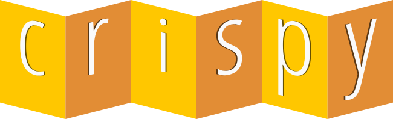

# Crispy

Version 1.6.0

Unit testing framework built in GML for GameMaker Studio 2.3.6+

## Installation

1. [Download the **.yymps** file](https://github.com/bfrymire/crispy/releases/latest)
1. Import the **.yymps** file into your project from the top menu
    * Tools **>** Import Local Package

You can also drop the **.yymps** file downloaded from the [Releases](https://github.com/bfrymire/crispy/releases/latest) tab directly onto your GMS IDE and follow the prompts.

## Getting Started

A good starting point is copying and pasting the code from the [Wiki's Quick Start page](https://github.com/bfrymire/crispy/wiki/Quick-Start) into the Create Event of an object created specifically for running tests.

Expand upon the code to suit your testing needs.

* [Go to the Crispy Wiki](https://github.com/bfrymire/crispy/wiki)

## Attributions

* Color palette from [Dracula Theme](https://github.com/dracula/dracula-theme#color-palette)

## License

[MIT License](./LICENSE) &copy; Brent Frymire
