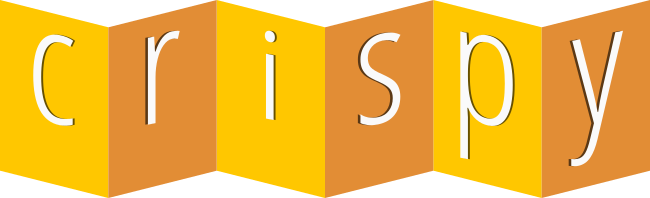

    

 

    <h1>
        Crispy <small>v1.8.5</small>
    <h1>

    Unit testing framework built in GML for GameMaker LTS 2022+

----

## About

Crispy is a GameMaker unit testing framework that helps you test your code and keep it future proof.

I first became interested in the idea of creating a unit testing library for GameMaker after watching this [video about how Minecraft handles its automated tests](https://youtu.be/vXaWOJTCYNg?t=50).

## Features

* Easy introduction to unit testing
* Discover test cases within scripts for better organization
* Helper assertion methods for equal checks
* [Garbage collectable](https://manual.gamemaker.io/monthly/en/GameMaker_Language/GML_Reference/Garbage_Collection/Garbage_Collection.htm)

## Supported Exports

Crispy is created using pure GameMaker Language and should be compatible with a wide range of exports.

## License

Crispy is provided under the [MIT License](https://github.com/bfrymire/crispy/blob/master/LICENSE).
